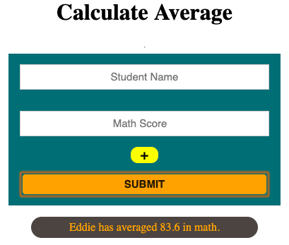

# Unit 1 - Exercise Two (Self Improved) | Calculate Average

## Given Objective

Create a program with the following variables _test1 = 60_, _test2 = 75_, _test3 = 80_. Then use a variable to determine the average score of the test. Use an alert to display the test score.

Extra credit: Make the program ask for the students name as well and then alert the student, _"(studentName) has averaged a (avgScore) in math."_

### Solution/Features

- Use of ES6 variables, functions and conditionals
- Data collection using HTML input elements instead of prompt
- CSS style applied for appearance
- Display results using template literals and rendering to an HTML paragraph element
- Making use of Event Listener functions
- User ability to add as many inputs as they wish, the program will calculate average based on number of valid entries
- Conditional checks to ensure data is not missed or empty
- Empty inputs are ignored and not used to total score
- Empty _name_ input results in a standard _student_ title rendering in result
- All entries converted to number to ensure properly calculation
- Conditional check to ensure there is data to calculate, if not a message is renderd with the message _No data entered_
- ES6 function created to remove extra inputs upon form submit/reset

## View Instructions

Click on the _u1ex2a.hmtl_ file above to view the HTML structure, content and link to the JS file. To view the JS file click on the _JS_ folder above where you will find a single file named _main_. You may also view the images and/or CSS file by clicking on their respective folder names above.
