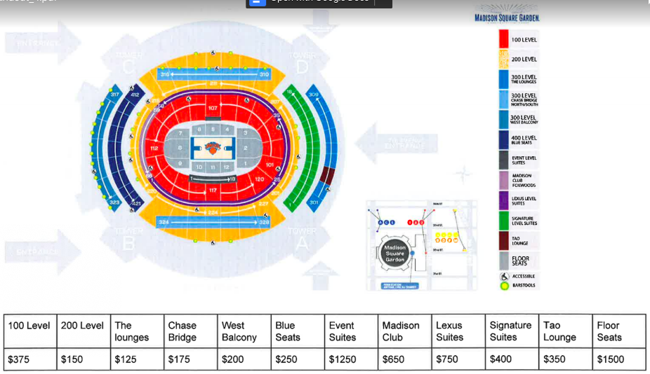

# Unit 3 - Exercise One (Assigned) | MSG Ticket Seating

## Objective

Ticket price by seating; Help the Knicks develop an app to help their patrons understand ticket pricing via seating location. (Use any means of conditional statements).

The APP should output:

- The section number the patron would like to sit and the level name.
- The amount of tickets the patron would like to buy and the total price of their purchase.

### Solution/Features

- Use of ES6 Function declaration
- use of _querySelector_
- use of _innerHTML_ to input new _p_ elements
- use of click _eventListerner_

## View Instructions

Click on the _u4ex1.hmtl_ file above to view the HTML structure, content and link to the JS file. To view the JS file click on the _JS_ folder above where you will find a single file named _main_.
